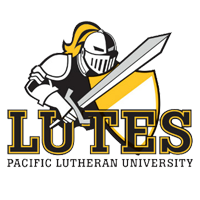
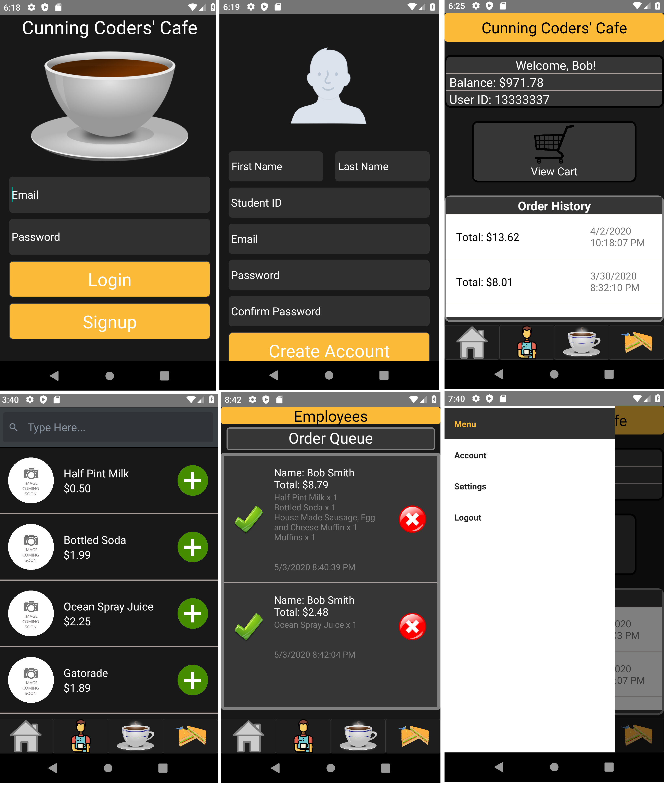
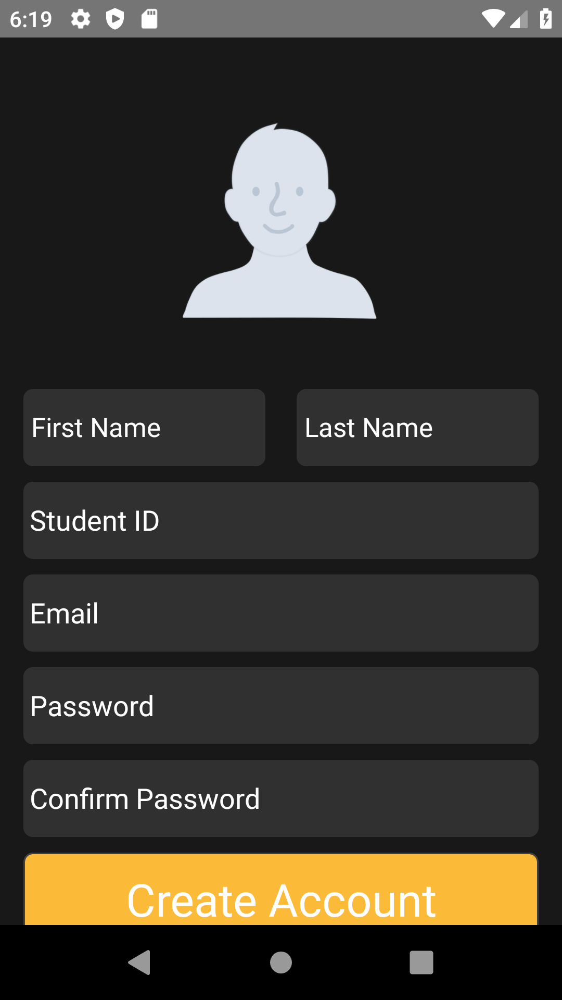
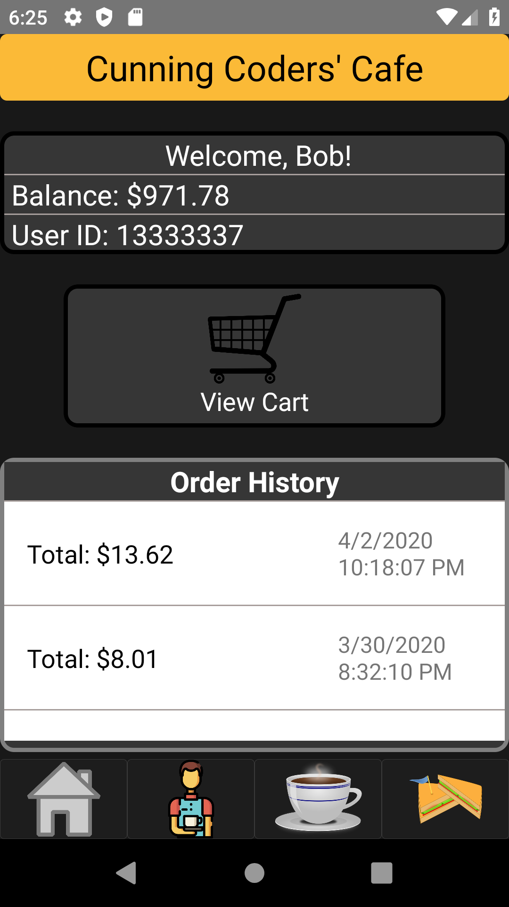
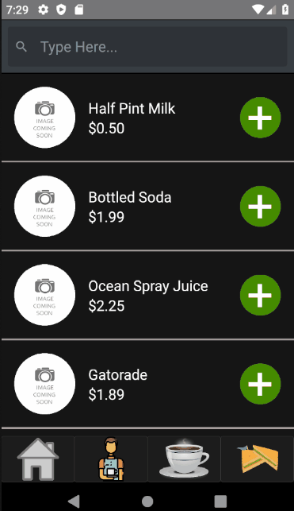
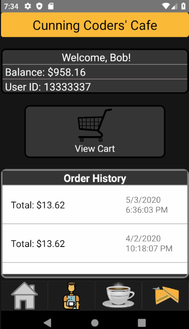
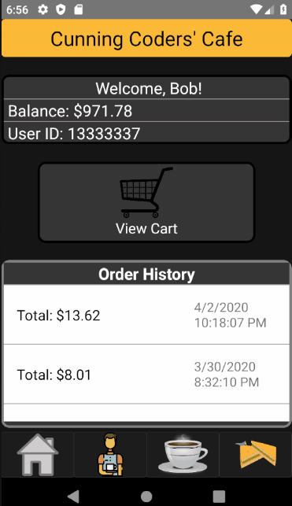
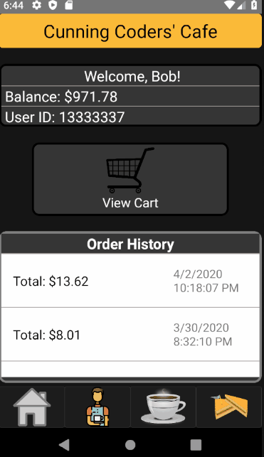

# Cunning Coders' Cafe

## Abstract
Cunning Coders’ Cafe is a mobile food ordering application written for Android and iOS phones. 
Users are able to create an account with a balance, view menus of available food and drinks, and can 
place an order for pickup. Employees can view the list of orders that have been placed and approve or 
deny them before getting the order ready for the customer. The application’s UI was built with React-Native 
which is a JavaScript framework that uses one codebase to compile to both Android and iOS. The backend 
includes an ASP.NET web API written in C# hosted on AWS Elastic Beanstalk, and a MySQL database hosted 
on AWS RDS.

## Built With

* [React-Native](https://reactnative.dev/) - JavaScript multi-platform framework developed by Facebook.
* [C#](https://docs.microsoft.com/en-us/dotnet/csharp/) - Backend API and logic.
* [MariaDB](https://mariadb.org/) - Relational database management system.
* [AWS Elastic Beanstalk](https://aws.amazon.com/elasticbeanstalk/) - Used to host the C# API.
* [AWS RDS](https://aws.amazon.com/rds/) - Used to host a MariaDB database instance.

## Demo

### A user can start off by creating an account by filling out the following forms:

### After logging in, the user will be brought to the following home page:

### Users can browse the menus and select items to order:

### After making an order, employees can view an order queue containing the pending orders:
From this page employees can approves or deny an order, completing the ordering process.

### Users can view their order history and place an order again if they wish:

## Authors:
* Sam Driver
* Michael Garcia
* Nick Sundvall

## Mentor: 
* Dr. Blaha
